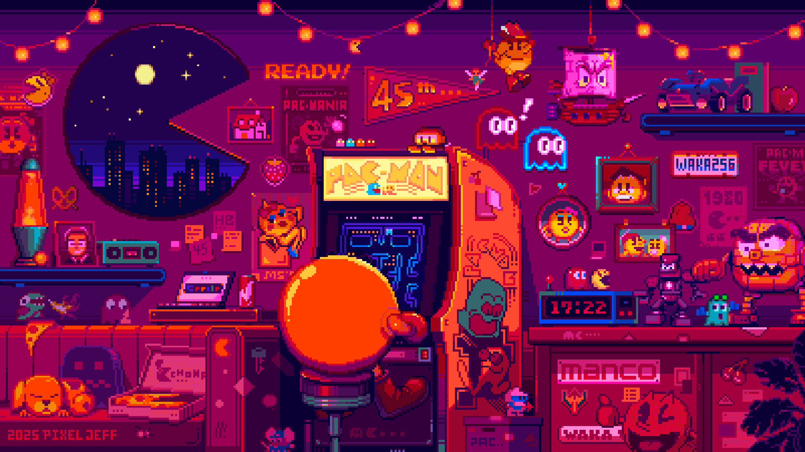

# Geovitæ

	

## Formazione

- **[Laurea Magistrale in Scienze Statistiche, Finanziarie e Attuariali](https://stat.unibo.it/)** — *Università di Bologna*, in corso.
- **[Laurea in Informatica](https://di.unipi.it/)** — *Università di Pisa*, votazione 110 e lode/110.
- **[Ingegneria Meccanica](https://meccanica.ing.unipi.it/)** — *Università di Pisa*, interrotto.

## Lingue

- **Inglese** — Uso avanzato parlato e scritto, *Cambridge C1 Advanced (IELTS 7.0)*.
- **Francese** — Comprensione base parlato e scritto, *certificazione DELF A2*.

## Programmazione

- **Linguaggi** — *C*, *Go*, *Java*, *Scala*, *Bash*, *Awk*, *Python*, *R*, *Scheme*, *JavaScript*, *OCaml*, *Haskell*.
- **Unix** — Gestione *GNU/Linux* e *FreeBSD*, programmazione di sistema in *C*, buona conoscenza standard *POSIX*.
- **Strumenti** — Esperienza con ambienti di sviluppo come *Vim*, *Tmux*, *Emacs*, *Git*, *LaTeX*, *Matlab* e *Mathematica*.
- **Extra** — Conoscenza di *SQL*, *HTML* e *CSS*.

## Esperienze

Oltre ai progetti personali, raccolti e documentati su [`geoteo.net`](https://geoteo.net), negli anni ho affiancato lo studio con alcune esperienze formative e professionali.

- **IMC Challenge** — Primo team italiano e 208° classificato al mondo nell'edizione 2025 dell'*IMC Prosperity Challenge*, competizione internazionale di trading algoritmico della durata di 15 giorni con oltre 12.000 partecipanti. In squadra con altri tre studenti dell'*Università di Padova* in *Computational Finance* e *Statistica*, abbiamo implementato algoritmi di trading in *Python*, affrontato complessi problemi di probabilità e ottenuto la miglior prestazione nazionale, chiudendo il round finale con un profitto di +155K.
- **Assistente Lab.** — Supporto alla didattica, a fianco della prof.ssa Pelagatti, come assistente per il laboratorio di *C* dell'esame di Informatica per il corso di Laurea in *Fisica* dell'*Università di Pisa*. L'incarico comprendeva aiutare gli studenti durante le esercitazioni e correggere gli elaborati consegnati.
- **Hackathon** — Primo posto nell'edizione 2021 di *ContHackt*, organizzata dall'*Università di Pisa* e da *Contamination Lab Pisa*. Come team vincitori abbiamo avuto accesso al progetto 2021/2022 *EUAcceL*, organizzato dalla *European Institute of Innovation and Technology*, vincendo la fase finale con un prototipo di blockchain per la tracciabilità dei prodotti alimentari.
- **Progetto CNR** — Esperienza come programmatore *Python*, insieme a un collega, presso gli uffici *CNR* di Pisa per la realizzazione di un plastico interattivo destinato a persone non vedenti. Il progetto si è svolto sotto la supervisione del dott. Furfari del *CNR* e della prof.ssa Pelagatti dell'*Università di Pisa*.
- **Ripetizioni** — Supporto a studenti universitari in Matematica, Informatica e Fisica; attività che mi ha aiutato a sviluppare buone capacità comunicative e di adattamento, oltre che a rafforzare le conoscenze di base.

## Sport

Oltre dieci anni di attività agonistica nella *vela*, a livello nazionale e internazionale, nelle classi Optimist, 420 e 470; per gran parte del percorso tra le file della Squadra Nazionale Giovanile. Ho partecipato a regate di alto livello, tra cui *Kiel Week* e *Barcolana*, due tra gli eventi velici più importanti al mondo.

- **Nazionale** — Primo classificato in una ranking list nazionale e altre quattro volte piazzato tra i primi dieci junior italiani. Vincitore di una *Young Barcolana*, una *Mediterranean Cup* e un *Trofeo Accademia Navale Juniores*.
- **Internazionale** — Convocato nella Squadra Nazionale Italiana per un Campionato del Mondo (Qingdao - Cina), tre Campionati Europei (Tavira - Portogallo, Dublino - Irlanda, Riva del Garda - Italia) e vicecampione in un Campionato Europeo a squadre (Berlino - Germania).
